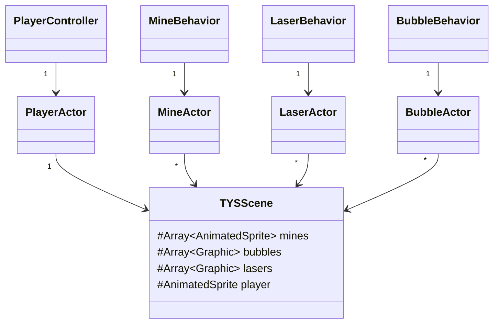

# The Yellow Submarine
This project demonstrates how to make an invinite scroller type of game with simple collision detection, but no physics, some sprite animation, and some custom WebGL rendering using shaders. The game uses Wolfie2D, a game engine created by Richard McKenna to teach how game engines are constructed for CSE 380 (2D Game Programming) at Stony Brook University with lots and lots of design and implementation from Joe Weaver. Further help was given by Zachary Grandison, Peter Walsh, and Kevin Cai, all undergraduate students at Stony Brook University.

## Introduction
In making this infinite scroller game, using the Typescript programming language and the Wolfie2D game engine, one will start to become familiar with the Wolfie2D game engine and specifically develop an understanding of:
* How the code base is organized
* How levels and content are loaded
* How to customize a user interface
* How to receive and respond to game events use Wolfie2D's EventQueue
* Deal with simple collision detection
* Load sprites and animated sprites in Wolfie2D
* Define a custom shader in Wolfie2D
* Record and replay games in Wofie2D
* Set random numbers/seeds in Wolfie2D

## Reading Material
[Game Programming Patterns](https://gameprogrammingpatterns.com/contents.html) (your textbook) is a great textbook if you're interested in design patterns for games. The following four chapters are the most relevant for this project:

* [Game-loop](https://gameprogrammingpatterns.com/game-loop.html)
* [Update Method](https://gameprogrammingpatterns.com/update-method.html)
* [Event Queue](https://gameprogrammingpatterns.com/event-queue.html)
* [Object Pool](https://gameprogrammingpatterns.com/object-pool.html)

## Getting Started
First, you'll need to clone the base code in this repository and set up a repository on Github. After you've cloned the base code, run `npm install`. Once the node modules have been installed, run `gulp` from the project's root directory to transpile the code. This will generate the index.html and bundle.js files inside the dist directory. Note, the dist directory already contains game assets. You can then launch your Web server to view the generated index.html file, which should load the initial game.

> If you've never worked with git, Github, or a node project and you don't know how to get set up, please reach out for help. Don't struggle in silence with the setup.

## Codebase Files
The structure of the-yellow-submarine codebase looks similar to the tree diagram shown below.
```
.
├── LICENSE.md
├── README.md
├── dist
│   ├── demo_assets						<-- Assets that come with the engine
│   └── game_assets						<-- The Yellow Submarine=specific assets
│       ├── shaders							<-- The Yellow Submarine-specific shaders
│       │   ├── bubble.fshader
│       │   ├── bubble.vshader
│       │   ├── laser.fshader
│       │   └── laser.vshader
│       ├── sprites
│       │   ├── SpikyMineThing.png
│       │   └── WavyBlueLines.png
│       └── spritesheets
│           ├── AYellowBarrelWithWindows.json
│           ├── AYellowBarrelWithWindows.png
│           ├── SpikyMineThing.json
│           └── SpikyMineThing.png
├── gulpfile.js
├── package-lock.json
├── package.json
├── src
│   ├── Wolfie2D
│   ├── the-yellow-submarine	<-- The Yellow Submarine-specific source code files
│   │   ├── TYSControls.ts
│   │   ├── TYSEvents.ts
│   │   ├── ai
│   │   │   ├── BubbleBehavior.ts
│   │   │   ├── LaserBehavior.ts
│   │   │   ├── MineBehavior.ts
│   │   │   └── PlayerController.ts
│   │   ├── scenes
│   │   │   ├── GameOver.ts
│   │   │   ├── TYSScene.ts
│   │   │   └── MainMenu.ts
│   │   └── shaders
│   │       ├── BubbleShaderType.ts
│   │       └── LaserShaderType.ts
│   ├── index.d.ts
│   ├── index.html
│   └── main.ts
└── tsconfig.json
```
Most of the work you'll be doing to complete this game will be in the `src/the-yellow-submarine` folder. You'll also have to work with the some shader code. The shader files for this game are in `dist/game_assets/shaders`.

## Codebase Structure
This infinite scroller game has a structure similar to the diagram shown below. The scene manages several collections of actors/objects (lasers, bubbles, mines, etc.) and each of those actors has some behavior (AI component) associated with. 



The TYSScene is responsible for managing it's object pools, performing basic collision detection, moving the background, keeping track of the player's score, and updating the UI. Playing animations, handling collisions, and updating the state of our actors (player, mines, bubbles, lasers) is delegated to each actors AI component.

## Part 1 - Playing Animations
In this game there are two animated sprites. Each animated sprite should respond to various game events by playing its different animations. 

* The Player
	- When the player takes damage from any source (mine or suffocation) the player's sprite should play its `HIT` animation if it's not already playing.
	- When the player's health reaches 0, the player should play its `DEATH` animation. 
	- Otherwise, the player should play it's `IDLE` animation, if it's not already playing.

* The Mine
	- When the mine collides with the player, the mine should play it's `EXPLODING` animation.
	- Otherwise, the mine should play it's `IDLE` animation.

All `AnimatedSprites` in Wolfie2D expose an AnimationManager that can be used to play animations associated with an animated sprite. 
```typescript
// The AnimatedSprite class
class AnimatedSprite extends Sprite {
    // The AnimationManager - manages playing sprite animations
    animation: AnimationManager     
}
```
If you want to know more about the different ways you can play animations using the animation manager, I recommend checking out the code in the `AnimationManager` class.

## Part 2 - Updating the HUD
Inside the TYSScene, there is a small HUD (head-up-display) used to display statistics about the player.
* How much health the player has left
* How much air the player has left
* The current number of charges the player's laserbeam has
It's up to you to propegate changes to the players state (health and air) to the HUD. 

### Part 2.1 - Updating the Healthbar
Inside the `PlayerController` class, there are two fields used to keep track of the current and maximum health of the player. When either the current or maximum health of the player changes, the HUD in the TYSScene should be updated to reflect how much health the player has left. 

You should update the player's healthbar using the `handleHealthChange` function inside the TYSScene class. The method has been implemented for you. All you have to do is call the method.

```typescript
/**
 * This method handles updating the player's healthbar in the UI.
 * 
 * @param currentHealth the current health of the player
 * @param maxHealth the maximum amount of health the player can have
 * 
 * @remarks
 * 
 * The player's healthbar in the UI is updated to reflect the current health
 * of the player. The method should be called in response to a player health
 * change event.
 * 
 * The player's healthbar has two components:
 * 
 * 1.) The actual healthbar (the colored portion)
 * 2.) The healthbar background
 * 
 * The size of the healthbar background should reflect the maximum amount of
 * health the player can have. The size of the colored healthbar should reflect
 * the current health of the player.
 * 
 * If the players health is less then 1/4 of the player's maximum health, the
 * healthbar should be colored red. If the players health is less then 3/4 of
 * the player's maximum health but no less than 1/4e the player's maximum health, 
 * then the healthbar should appear yellow. If the player's health is greater 
 * than 3/4 of the player's maximum health, then the healthbar should appear green.
 * 
 * @see Color for more information about colors
 * @see Label for more information about labels 
 */
 protected handleHealthChange(currentHealth: number, maxHealth: number): void {
 	// Implementation not shown
 }
```

### Part 2.2 - Updating the Airbar
Similar to the player's health, there are two fields attached to the PlayerController for the current and maximum air of the player. When either the current or maximum air of the player changes, the HUD in the TYSScene should be updated to reflect how much air the player has left. 

You should update the player's airbar using the `handleAirChange` function inside the TYSScene class. The function has been implemented for you. 

```typescript
/**
 * This method handles updating the player's air-bar in the UI.
 * 
 * @param currentAir the current amount of air the player has
 * @param maxAir the maximum amount of air the player can have
 * 
 * @remarks
 * 
 * This method functions very similarly to how handleHealthChange function. The
 * method should update the UI in response to a player-air-change event to 
 * reflect the current amount of air the player has left.
 * 
 * The air-bar has two components:
 * 
 * 1.) The actual air-bar (the colored portion)
 * 2.) The air-bar background
 * 
 * The size of the air-bar background should reflect the maximum amount of
 * air the player can have. The size of the colored air-bar should reflect
 * the current amount of air the player has.
 * 
 * Unlike the healthbar, the color of the air-bar should be a constant cyan.
 * 
 * @see Label for more information about labels
 */
protected handleAirChange(currentAir: number, maxAir: number): void {
	// Implementation not shown
}
```

## Part 3 - Dealing with Collisions
In the TYSScene, 3 types of collisions can occur:

1. Player-Mine collisions (AABB to AABB)
2. Player-Bubble collisions (AABB to Circle)
3. Mine-Laser collisions (AABB to AABB)

The Mine-Laser collisions have been implemented for you. Getting the Player-Mine and Player-Bubble collisions to work is up to you.

### Part 3.1 - Player-Mine Collisions
Inside the TYSScene class, there is a method called `handleMinePlayerCollisions(): number`. The method checks for collisions between the mines and the player in every frame. It looks something like this:

```typescript
/**
 * Handles collisions between the mines and the player. 
 * 
 * @return the number of collisions between mines and the players
 * 
 * @remarks 
 * 
 * The collision type is an AABB to AABB collision. Collisions between the player and the mines 
 * need to be checked each frame.
 * 
 * If a collision is detected between the player and a mine, the player should be notified
 * of the collision, and the mine should be made invisible. This returns the mine to it's
 * respective object-pool.
 * 
 * @see TYSEvents.PLAYER_ROCK_COLLISION the event to be fired when a collision is detected
 * between a mine and the player
 */
public handleMinePlayerCollisions(): number {
	// Implementation not shown (see the source code)
}
```

When a mine collides with the player, an event gets fired to the EventQueue to alert the rest of the system that the player has collided with a mine. It's up to you to catch and handle these events. When a player collides with a mine, several things should happen:

1. The player should lose a health point, play a "hurt" animation, and become invincible for 1 or 2 seconds.
2. The mine should play its explosion animation and, after the animation has finished playing, the mine should be made invisible (returning the mine to the mine object pool).

### Part 3.2 - Player-Bubble Collisions
Inside the TYSScene class, you'll have to do some manual collision detection between the bubbles and the player's sprite. The method is similar to the `handleMinePlayerCollisions()` method.

```typescript
/**
 * Handles collisions between the bubbles and the player.
 *  
 * @return the number of collisions between the player and the bubbles in a given frame.
 * 
 * @remarks
 * 
 * The collision type is AABB to Circle. Detecting these collisions should be done using the 
 * checkAABBtoCircleCollision() method in the scene.
 * 
 * Collisions between the player and bubbles should be checked during each frame. If a collision 
 * is detected between the player and a bubble, the player should get back some air (+1) and the
 * bubble should be made invisible and returned to it's object pool.
 * 
 * @see TYSScene.checkAABBtoCircleCollision the method to be used to check for a collision between
 * an AABB and a Circle
 */
public handleBubblePlayerCollisions(): number {
    // TODO Handle checking for collisions between the bubbles and the player
    return;
}
```

When a collision is detected between the player and a bubble, two things should happen:

1. The player's `currentAir` value should be increased by 1
2. The bubble should be made invisible (returning the bubble to the bubble object pool)

When and where you respond to the collision is up to you. Additionally, the collision type between the player and a bubble is an AABB to Circle collision. To check for these collisions, you'll have to implement the static method `checkAABBtoCircleCollision()` method attached to the TYSScene class.

```typescript
/**
 * This method checks for a collision between an AABB and a circle.
 * 
 * @param aabb the AABB
 * @param circle the Circle
 * @return true if the AABB is colliding with the circle; false otherwise. 
 * 
 * @remarks 
 * 
 * Checking for a collision between an AABB and a circle is not trivial. I recommend taking a look 
 * at the link below. I am aware that there is some sample code there. Personally, I found the diagrams
 * to be much more intuitve to follow along with than the sample code. 
 * 
 * @see AABB for more information about AABBs
 * @see Circle for more information about Circles
 * @see MathUtils for more information about MathUtil functions
 */
public static checkAABBtoCircleCollision(aabb: AABB, circle: Circle): boolean {
	// TODO implement AABB to Circle collision detection
}
```

## Part 4 - Spawning/Despawning Objects
For part 4, you'll have to work with the `Viewport` class to figure out where to spawn/despawn the bubbles and the mines. All classes extending the base Scene class have a field called `viewport` and a method called `getViewport()` that returns a reference to the viewport.

### Part 4.1 - Spawning Bubbles
Inside the TYSScene class, there is a method called `spawnBubble()` for you to implement. The method finds a bubble object not currently in use and spawns it, just outside the viewport.
```typescript
/**
 * This method handles spawning a bubble from the object-pool of bubbles
 * 
 * @remark
 * 
 * If there are no bubbles in the object-pool, then a bubble shouldn't be spawned and 
 * the bubble-spawn timer should not be reset. Otherwise a bubble should be spawned
 * and the bubble-spawn timer should be reset.
 * 
 * Bubbles should randomly spawn inside of the padded area of the viewport just below
 * the visible region of the viewport. A visualization of the padded viewport is shown 
 * below. o's represent valid bubble spawn locations. X's represent invalid locations.
 * 
 * 
 * 					 X THIS IS OUT OF BOUNDS
 * 	 _______________________________________________________________________________________________
 * 	|	 			THIS IS THE PADDED REGION (OFF SCREEN)				|
 * 	|						X					X	|
 * 	|		 _______________________________________________________________		|
 * 	|		|								|		|
 * 	|		|								|		|
 *	|		|	  	THIS IS THE VISIBLE REGION			|		|
 * X	|	X	|			 					|	X	|   X 
 * 	|		|								|		|
 * 	|		|		X						|		|
 * 	|		|_______________________________________________________________|		|
 * 	|			o			o			o		X	|
 * 	|_______________________________________________________________________________________________|
 * 
 * 					X THIS IS OUT OF BOUNDS
 */
protected spawnBubble(): void {
	// TODO spawn bubbles!
}
```

* If there are no inactive bubble objects in the bubble object pool, the method should do nothing.
* If an inactive bubble is found;
	* The bubble should have its visible flag set to `true`
	* The bubbles position should be set to a random position in the padded region of the viewport
	* The bubble spawn timer should be reset

### Part 4.2 - Despawning Mines and Bubbles
Inside the TYSScene class, there is a method called `handleScreenDespawn(node: CanvasNode)` that you must implement. The method handles despawning any mines and bubbles that have moved beyond the padded region of the viewport, returning them to their object pools.
```typescript
/**
 * This function takes in a GameNode that may be out of bounds of the viewport and
 * "kills" it as if it was destroyed through usual collision. This is done so that
 * the object pools are refreshed. Once an object is off the screen, it's no longer 
 * in use.
 * 
 * @param node The node to wrap around the screen
 * @param viewportCenter The center of the viewport
 * @param paddedViewportSize The size of the viewport with padding
 * 
 * @remarks
 * 
 * You'll notice that if you play the game without changing any of the code, miness will 
 * suddenly stop coming. This is because all of those objects are still active in the scene,
 * just out of sight, so to our object pools we've used up all valid objects.
 * 
 * Keep in mind that the despawn area in this case is padded, meaning that a GameNode can 
 * go off the side of the viewport by the padding amount in any direction before it will be 
 * despawned. 
 * 
 * A visualization of the padded viewport is shown below. o's represent valid locations for 
 * GameNodes, X's represent invalid locations.
 * 
 * 
 * 					 X THIS IS OUT OF BOUNDS
 * 	 _______________________________________________________________________________________________
 * 	|	 		THIS IS THE PADDED REGION (OFF SCREEN)					|
 * 	|						o						|
 * 	|		 _______________________________________________________________		|
 * 	|		|								|		|
 * 	|		|								|		|
 *	|		|	  	  THIS IS THE VISIBLE REGION			|		|
 * X	|	o	|			 					|	o	|   X 
 * 	|		|								|		|
 * 	|		|		o						|		|
 * 	|		|_______________________________________________________________|		|
 * 	|							o					|
 * 	|_______________________________________________________________________________________________|
 * 
 * 					X THIS IS OUT OF BOUNDS
 * 
 * It may be helpful to make your own drawings while figuring out the math for this part.
 */
public handleScreenDespawn(node: CanvasNode): void {
	// TODO - despawn the game nodes when they move out of the padded viewport
}
```

## Part 5 - Wrapping and Locking
Right now, the player can move off the screen as far as they want in any direction. There are various strategies for handling what should happen when the player ventures outside the viewport. For this game, you're going to wrap and lock the player on the screen.

> Wrapping and locking the player's position needs to be done every frame. I have setup two helper methods for wrapping and locking the the player's position (see 5.1 and 5.2) but it's up to you to figure out where and when to call the functions. 

### Part 5.1 - Wrapping the Player
Inside the TYSScene class, two methods need to be implemented to lock and wrap the player's position. When the player moves halfway off the top or bottom of the screen, the player's sprite should be "wrapped" around to the other side of the screen.
```typescript
/**
 * Function that wraps the player's y-coordinates, if they have moved halfway into the padded
 * region of one side of the viewport.
 * 
 * @param player - the GameNode associated with the player
 * @param viewportCenter - the coordinates of the center of the viewport
 * @param viewportHalfSize - the halfsize of the viewport
 * 
 * @remarks
 * 
 * Wrapping the player around the screen involves moving the player over from one side of the screen 
 * to the other side of the screen once the player has ventured too far into the padded region. To do
 * this, you will have to:
 * 
 * 1.) Check if the player has moved halfway out of the visible region in the y-direction
 * 2.) Update the player's position to the opposite side of the visible region
 * 
 * @see {Viewport} for more information about the viewport
 * 
 * For reference, a visualization of the padded viewport is shown below. The o's represent locations 
 * where the player should be wrapped. The O's represent locations where the player should be wrapped to. 
 * The X's represent locations where the player shouldn't be wrapped
 * 
 * Ex. the player should be wrapped from o1 -> O1, from o2 -> O2, etc. 
 * 
 * 
 * 					X THIS IS OUT OF BOUNDS
 * 	 _______________________________________________________________________________________________
 * 	|	 			THIS IS THE PADDED REGION (OFF SCREEN)				|
 * 	|												|
 * 	|											    	|
 * 	|		 ___o1_____________________________________________________O2___		|
 * 	|		|								|		|
 * 	|		|								|		|
 *	|		|	  	THIS IS THE VISIBLE REGION			|		|
 * X	|	X	|			 					|	X	|   X 
 * 	|		|								|		|
 * 	|		|		X						|		|
 * 	|		|___O1_____________________________________________________o2___|		|
 * 	|		   										|
 * 	|		   						   				|
 * 	|_______________________________________________________________________________________________|
 *
 * 				 	X THIS IS OUT OF BOUNDS								
 */
protected wrapPlayer(player: CanvasNode, viewportCenter: Vec2, viewportHalfSize: Vec2): void {
	// TODO wrap the player around the top/bottom of the screen
}
```

### Part 5.2 - Locking the Player
In addition to wrapping the player's position, there is another method called `lockPlayer()` that should prevent the player from moving beyond the left or right side of the viewport.  More specifically, the left edge of the player's sprite should not move beyond the left edge of the viewport and the right side of the player's sprite should not move outside the right edge of the viewport.
```typescript
/**
 * A function for locking the player's coordinates. The player should not be able to move off the 
 * left or right side of the screen.
 * 
 * @param player - the CanvasNode associated with the player
 * @param viewportCenter - the coordinates of the center of the viewport
 * @param viewportHalfSize - the halfsize of the viewport 
 * 
 * @see {Viewport} for more information about the viewport
 * 
 * @remarks
 * 
 * More specifically, the left edge of the player's sprite should not move beyond the left edge 
 * of the viewport and the right side of the player's sprite should not move outside the right 
 * edge of the viewport.
 * 
 * For reference, a visualization of the padded viewport is shown below. The o's represent valid
 * locations for the player and the X's represent invalid locations for the player.
 * 	  
 * 					 X THIS IS OUT OF BOUNDS
 * 	 _______________________________________________________________________________________________
 * 	|	 		 	X THIS IS THE PADDED REGION (OFF SCREEN)			|
 * 	|												|
 * 	|						X					    	|
 * 	|		 ______o______________o_________________________________________		|
 * 	|		|								|		|
 * 	|		|								|		|	
 * X	|		|	  THIS IS THE VISIBLE REGION				|		|
 * 	|		|o			 			  	       o|	X	|   
 * 	|		|								|		|
 * 	|	X   	|		o						X		|
 * 	|		|_____o_______________o_________________________________________|		|
 * 	|		   										|
 * 	|		   				X		   				|
 * 	|_______________________________________________________________________________________________|
 *
 * 					X THIS IS OUT OF BOUNDS	
 * 
 */
protected lockPlayer(player: CanvasNode, viewportCenter: Vec2, viewportHalfSize: Vec2): void {
	// TODO prevents the player from moving off the left/right side of the screen
}
```

## Part 6 - Interfacing with the Playback System
For this game, you have to use Wolfie2Ds existing playback system to record the TYSScene. There are three events you can use to interact with the existing playback system (shown below).

```typescript
enum GameEventType {

  	/**
	 * Start Recording event. Has data: {recording: Recording}
	 */
	START_RECORDING = "start_recording",

	/**
	 * Stop Recording event. Has data: {}
	 */
	STOP_RECORDING = "stop_recording",
	
	/**
	 * Play Recording event. Has data: {onEnd: () => void}
	 */
	PLAY_RECORDING = "play_recording",
	
}
```

A couple of notes on recording things in this game:

1. The start recording event takes a recording. I recommend using a new `BasicRecording` object. In theory, you could create your own Recording type that implements the Recording interface, but I don't recommend it.
2. The game relies on generating random numbers to spawn the mines and the bubbles. You will need to find a way to save and set the random seed in order for your recording to replay correctly.
3. When the recording stops playing, the game should transition back to the MainMenu scene.

## Part 7 - Shaders and WebGL
For this game, you are also, you're tasked with adding some functionality to the submarines laserbeam. 

### Part 7.1 - Color
First, find a way to pass the color of the laser beam into the fragement shader. In the main method of the fragment shader, the color has been hard coded to be just red. 
```c
void main(){
    // Hard coded color value
    gl_FragColor = vec4(255, 0, 0, 1.0);
    gl_FragColor.a = linear_laser(v_Position);
}
```
The color of the laserbeam should come from the color field on the laserbeam's `Graphic` object. For reference, here's a snippet from the graphic class.
```typescript
/**
 * The representation of a game object that doesn't rely on any resources to render - it is drawn to the screen by the canvas
 */
export default abstract class Graphic extends CanvasNode {
    /** The color of the Graphic */
    color: Color;
    
    // etc...
}
```
Inside the behavior (AI) for the laserbeam, the color of the laserbeam gradually changes from a redish color to a blue/purple ish color. If you successfully pass the color into the fragment shader, you should see the laserbeam fade to a purple/blue ish color.

### Part 7.2 - Sinwave
Right now, the submarines laserbeam fires in a straight line. You have to change the laserbeam to look like a sinwave.

In `laser.fshader` I have defined the function `float sinwave_laser(vec4 position)` that computes the alpha value for the color fragment based on a position (presumably from the vertex shader). The `float linear_laser(vec4 position)` also does this. 
```c
/**
 *  This function generates the appropriate alpha value for the fragment color
 *  to render a laser that looks like a sin wave. The alpha value depends on 
 *  the distance of the vertex position from the sine waves curve. Positions
 *  closer to the curve of the sin wave should have a higher alpha value.
 *
 *  +------------------------------------------------------+
 *  | 	   __	  __	 __	__     __     __	   | 
 *  | 	  /  \	 /  \	/  \   /  \   /	 \   /	\	   |
 *  |   _/    \_/    \_/    \_/	   \_/	  \_/	 \_	   |  
 *  | 							   |
 *  +------------------------------------------------------+
 *
 *  @param position - the position from the vertex shader (v_Position)
 *  @return - the alpha value of the fragment color
 */
float sinwave_laser(vec4 position);
```
Right now, the implementation of the method looks something like this:
```c
// TODO Get the laser to look like a sinwave
float sinwave_laser(vec4 position) {
    return 1.0;
}
```

> Debugging shader code is tricky because there are no print statements :scream: The best advice I can offer is to try and use different colors to figure out what's going on. 

> In the function I use to generate the linear laser, I make use of a couple built-in glsl functions. You can find a list of all the built-in functions you can use in your shaders [here](https://registry.khronos.org/OpenGL-Refpages/gl4/index.php).

## Final Note
The assignment is somewhat ambiguious. You may find that you need to change, modify, or add things to the game's codebase not mentioned in the description or marked by a TODO to get things working. You're more than welcome to do so. 

## Submission
Note that you <strong><em>must</em></strong> setup a Git repo and use it for your project <strong><em>throughout</em></strong> your development process.


